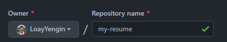

# Learn to Build A Static Website For Your Resume

## Purpose

This is a guide on how to host and format a resume using the following tools: Markdown, a Markdown 
editor, Github Pages, and Jekyll. This is written for computer science students interested in learning the general 
principals of current Technical Writing, as expalined by Andrew Etter's book [Modern Techncial Writing: An 
introduction to Software Documentation](https://www.amazon.ca/Modern-Technical-Writing-Introduction-Documentation-ebook/dp/B01A2QL9SS) and applying them
by hosting your own resume on a static website.

### Demo


## Prerequisites

- **Resume formated in Markdown**
  - Here is a [tutorial](https://www.markdowntutorial.com/) to learn the basics of Markdown.
  - An free [online Markdown editor](https://dillinger.io/) is available. 
- **Git** - A free open source distributed version control system. [Install Git](https://git-scm.com/book/en/v2/Getting-Started-Installing-Git)
- **Ruby** - An open source programming language. [Install Ruby](https://jekyllrb.com/docs/installation/)
- **Jekyll** - A static website generator. [Install Jekyll](https://jekyllrb.com/docs/installation/)
- **Github account** - [Sign up](https://github.com/join) for free!

NOTE: No experience with Markdown, GitHub, or the command line is assumed.

## Instructions

### 1. Fork a theme repository
- Go to a Jekyll theme respository.
  - Here is a [collection](https://github.com/pages-themes) of Jekyll themes for GitHub Pages
- Click the "Fork" button   

- Change the name of the repository  


### 2. Create a new branch
- Go to branch  

- Click the "New Branch" button
  - Give it a name
  - Click the "create branch" button


### 3. Host your website with Github Pages
- Go to `Settings > Pages`
- Select your new branch as the source and click the "save" button  


Note: Your static site is now hosted at `https://username.github.io/repository-name`. This may take a few minutes to 
  deploy

### 4. View the website locally
- Open the command line 
- Clone the respository with the command: `git clone https://github.com/LoayYengin/minimal.git`
  - To find the URL Click the "Code" button and copy the HTTPS link  

- Go into the repository: `cd "respository-name"`
- Change to the new branch: `git switch my-resume`
- Run the command `bundle install`
- Run the command `bundle exec jekyll build` to build your website (This will create a new directory 
  called "_site")
  - Only `jekyll build` is required after building your site for the first time.
- Go into _site: `cd _site`
- Run the command `bundle exec jekyll serve` 
  - Only `jekyll serve` is required after hosting your site locally for the first time.
- Open up a web browser and go to`localhost:4000` to preview your website

### 5. Customize your website locally
- Open index.md in a text editor
- Replace the contents in `index.md` with your Markdown formatted resume content 
```text
---
layout: default
---

# Your Markdown formatted resume
```  
- Run the command `jekyll build` to apply changes your website.
- Refresh your browser to view the update.

### 6. Update your remote repository
- Run the command `git add .` to stage all the files that were modified
- Commit your changes
  - `git commit on "your commit message"`
- Push your changes.
  - 'git push '
  
NOTE: It may take several minutes for GitHub pages update

## More Resources
- [Markdown tutorial](https://www.markdowntutorial.com/)
- [Modern Techncial Writing: An introduction to Software Documentation](https://www.amazon.ca/Modern-Technical-Writing-Introduction-Documentation-ebook/dp/B01A2QL9SS).
- [Jekyll Documentation](https://jekyllrb.com/docs/)
- [Jekyll Tutorial](https://www.mikedane.com/static-site-generators/jekyll/)

## Authors and Acknowledgements

- Author: Yengin Loay
- Group Members: 
  - Aidan
  - May
- Minimal Theme Author: Steve Smith

## FAQs

1. Why is Markdown better than a word processor?
- Many of the documents that we create in computer sicence is formatted as plain text such as source code (Java, 
  Python, C, etc.) are written in plain text. Furthermore, Writing Markdown formatted plain text files alows them to be opened 
  and read in almost all environments. Lastly, Markdown is a format that is long-lived; you can still open 
  and read files written in the 90s however, you can't open many word processor formats today. 
2. Why is my resume not showing up?