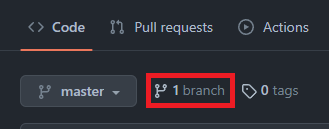

# Learn to Build A Static Website For Your Resume

## Purpose

This is a guide on how to host and format a resume using the following tools: Markdown, a Markdown 
editor, Github Pages, and Jekyll. This is written for computer science students interested in learning the general 
principals of current Technical Writing, as expalined by Andrew Etter's book [Modern Techncial Writing: An 
introduction to Software Documentation](https://www.amazon.ca/Modern-Technical-Writing-Introduction-Documentation-ebook/dp/B01A2QL9SS) and applying them
by hosting your own resume on a static website.

### Demo


## Prerequisites

- **Resume formated in Markdown**
  - Here is a [tutorial](https://www.markdowntutorial.com/) to learn the basics of Markdown.
  - A free [online Markdown editor](https://dillinger.io/) is available. 
- **Git** - A free open source distributed version control system. [Install Git](https://git-scm.com/book/en/v2/Getting-Started-Installing-Git)
- **Ruby** - An open source programming language. [Install Ruby](https://jekyllrb.com/docs/installation/)
- **Jekyll** - A static website generator. [Install Jekyll](https://jekyllrb.com/docs/installation/)
- **Github account** - [Sign up](https://github.com/join) for free!

NOTE: No prior experience with Markdown, GitHub, or the command line is required.

# Instructions
Begin with following the steps to [hosting a resume](#hosting-a-Resume). Next, learn about how they relate to the 
[principles of techncial writing](#Principles-of-Technical-Writing) in Etter's book. In the end you should have a 
working website with your resume on it and be more knowledgeable about modern technical writing.

## Hosting a Resume

### 1. Fork a theme repository
- Go to a Jekyll theme respository.
  - Here is a [collection](https://github.com/pages-themes) of Jekyll themes for GitHub Pages
- Click **Fork**  

- Change the name of the repository and click **Create fork**  


### 2. Create a new branch
- Go to branch  

- Click **New Branch**
  - Give it a name
  - Click **Create branch**


### 3. Host your website with Github Pages
- Go to `Settings > Pages`
- Select your new branch as the source and click **Save**   


Note: Your static site is now hosted at `https://username.github.io/repository-name`. This may take a few minutes to 
  deploy

### 4. View the website locally
- Open the command line 
- Clone the respository with the command: `git clone https://github.com/LoayYengin/minimal.git`
  - To find the URL Click **Code** and **copy** the HTTPS link  

- Go into the repository: `cd "respository-name"`
- Change to the new branch: `git switch my-resume`
- Run the command: `bundle install`
- Run the command: `bundle exec jekyll build` to build your website
- Go into the newly created directory _site: `cd _site`
- Run the command `bundle exec jekyll serve`
- Open up a web browser and go to`localhost:4000` to preview your website

### 5. Customize your website locally
- Open index.md in a text editor
- Replace the contents in `index.md` with your Markdown formatted resume content 
```text
---
layout: default
---

# Your Markdown formatted resume
```  
- Run the command `jekyll build` to apply changes your website.
- Refresh your browser to view the update.

### 6. Update your remote repository
- Run the command `git add .` to stage all the files that were modified in your current directory
- Commit your changes: `git commit on "your commit message"`
- Push your changes: `git push`
  
NOTE: It may take a few minutes for GitHub pages update

## Principles of Technical Writing

Relate the steps above to general principles of techncial writing

### Know your Audience

Audience awareness is essential for techncial writing. When creating your resume, it is important to keep your 
audience in mind. Who will be reading your resume and what kind of information are they looking for? Defining your 
audience allows you to tailor your resume by allowing you to know what key pieces of information is needed.

### Functional Documentation

Documentation should be able to tell teh reader what the product is and why tehy want ot use it. This can be simple 
and to the point, or it can be more elaborate, depending on the product. Regardless, it should be clear and concise, 
and structed in a way that is easy to follow.

### Style

Consistency is important in technical writing so that readers can easily understand what is being communicated. A 
consistent style also makes it easier for writers to produce clear and concise text. Use headers and subheaders to 
help organize information. Additionally, use lists, tables and images makes it easier for readers to scan and 
process the information.

### Use a Website

Hosting technical information on a website allows the writer to quickly and easily distribute their writing. This 
also allows the writer to keep their writing up-to-date and accessible to the widest possible audience.


## More Resources
- [Markdown tutorial](https://www.markdowntutorial.com/)
- [Modern Techncial Writing: An introduction to Software Documentation](https://www.amazon.ca/Modern-Technical-Writing-Introduction-Documentation-ebook/dp/B01A2QL9SS).
- [Jekyll Documentation](https://jekyllrb.com/docs/)
- [Jekyll Tutorial](https://www.mikedane.com/static-site-generators/jekyll/)

## Authors and Acknowledgements

- **Author**: Yengin Loay
- **Group Members**: 
  - Aidan
  - May
- **Minimal Theme Author**: Steve Smith

## FAQs

### 1. Why is Markdown better than a word processor?
- Many of the documents that we create in computer sicence is formatted as plain text such as source code (Java, 
  Python, C, etc.) are written in plain text. Furthermore, Writing Markdown formatted plain text files allows them 
  to be opened and read in almost all environments. Lastly, Markdown is a format that is long-lived; you can still open 
  and read files written in the 90s however, you can't open many word processor formats today.

### 2. Why am I seeing the following output after running `bundle exec jekyll serve`?
>Ruby31-x64/lib/ruby/gems/3.1.0/gems/jekyll-4.2.2/lib/jekyll/commands/serve/servlet.rb:3:in 'require': cannot load such file -- webrick (LoadError)`
- Some Jekyll templates use the WEBrick options to create custom headers which is no longer a bundled gem in Ruby 3.0
  - Run the command `bundle add webrick` to add the webrick dependecies.